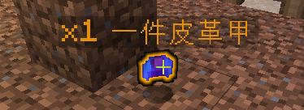

# 物品光效

```
ExampleItem:
  material: STONE
  options:
    color: GOLD
```



此选项可以使掉落物产生发光效果

可用颜色有：

* AQUA
* BLACK
* BLUE
* DARK\_AQUA
* DARK\_BLUE
* DARK\_GRAY
* DARK\_GREEN
* DARK\_PURPLE
* DARK\_RED
* GOLD
* GRAY
* GREEN
* LIGHT\_PURPLE
* RED
* WHITE
* YELLOW
