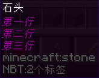
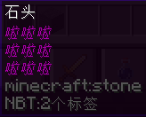
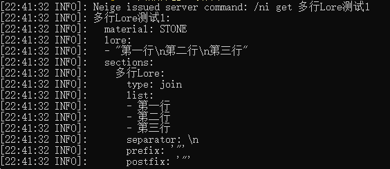
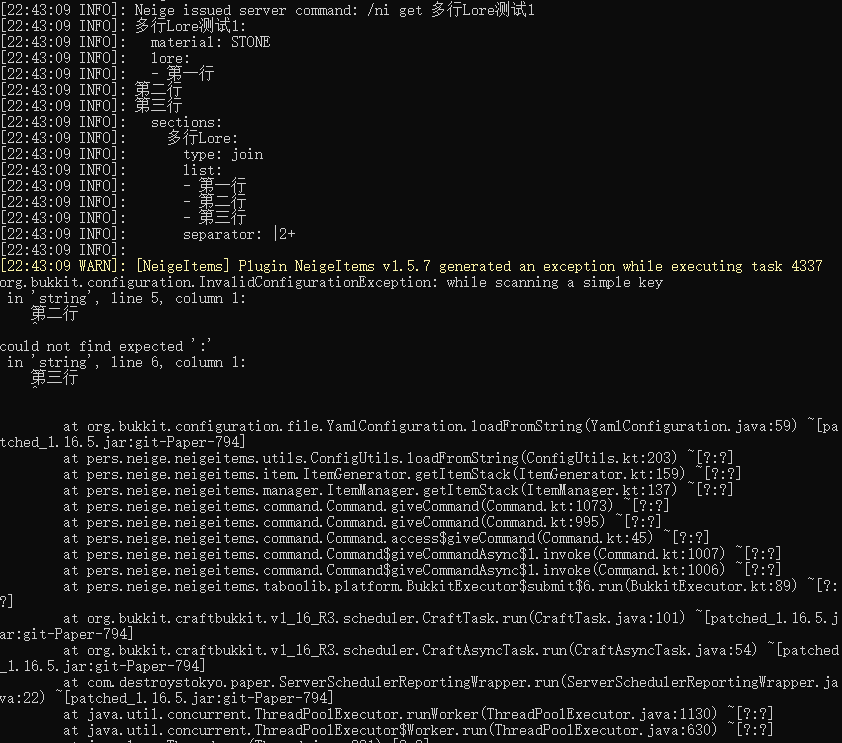

# 通过节点插入多行lore

## 方法1

```
多行Lore测试1:
  material: STONE
  lore:
  - <多行Lore>
  sections:
    多行Lore:
      type: join
      list:
        - 第一行
        - 第二行
        - 第三行
      separator: "\\n"
      prefix: '"'
      postfix: '"'
```


## 方法2

```
多行Lore测试2:
  material: STONE
  lore:
  - <多行Lore>
  sections:
    多行Lore: '"第一行\n第二行\n第三行"'
```



## 方法3

```
多行Lore测试3:
  material: STONE
  lore:
  - <多行Lore>
  sections:
    多行Lore:
      type: repeat
      content: 啦啦啦
      repeat: 3
      separator: "\\n"
      prefix: '"'
      postfix: '"'
```



## 值得一提

!> 本段内容较为复杂，如果你没有打破砂锅问到底的闲心，请跳过本部分

> 提问: 根据你写的配置，以方法1为例，`多行Lore`这一节点的返回值应该为`"第一行\\n第二行\\n第三行"`。你为什么要在两边加上双引号?你为什么要使用`"\\n"`？根据yaml语法，`"\\n"`应该代表形似`\n`的字符, `"\n"`才是换行符，你在搞什么，为什么最后这段配置运行正常？我想打死你:)
<br />
<br />回答: 世界比你想象的更加复杂，你先别急，让我先急:)
<br />
<br />首先, `多行Lore`这一节点的返回值不是`"第一行\\n第二行\\n第三行"`，而是`"第一行\n第二行\n第三行"`。
<br />对于这个join节点，节点返回值应该为`前缀`+`列表的第一项`+`分隔符`+`列表的第二项`+`分隔符`+`列表的第三项`+`后缀`。
<br />这个过程是拼接出来的。所以`"\\n"`作为字符体现为`\n`
<br />故结果为`"第一行\n第二行\n第三行"`
<br />
<br />下面我来解释一下不在两边加上双引号，并直接用换行符做separator会发生什么
<br />替换前:
<br />多行Lore测试1:
<br />&nbsp;&nbsp;material: STONE
<br />&nbsp;&nbsp;lore:
<br />&nbsp;&nbsp;- <多行Lore>
<br />替换后:
<br />多行Lore测试1:
<br />&nbsp;&nbsp;material: STONE
<br />&nbsp;&nbsp;lore:
<br />&nbsp;&nbsp;- 第一行
<br />&nbsp;&nbsp;第二行
<br />&nbsp;&nbsp;第三行
<br />是的，换行符不会以换行符形式出现，会直接变成回车（微笑）
<br />所以我们需要形似`"第一行\n第二行\n第三行"`的返回值
<br />替换后:
<br />多行Lore测试1:
<br />&nbsp;&nbsp;material: STONE
<br />&nbsp;&nbsp;lore:
<br />&nbsp;&nbsp;- "第一行\n第二行\n第三行"
<br />读取后刚好是正确的格式

> 提问: 我花一年时间理解了你上面那个屌问题。这种狗东西你怎么写出来的，脑测吗？
<br />
<br />回答：请善用debug。将plugin/NeigeItems/config.yml中的Main.Debug设置为true即可开启debug模式。
<br />开启后效果见下图



!> 错误示范见下图

